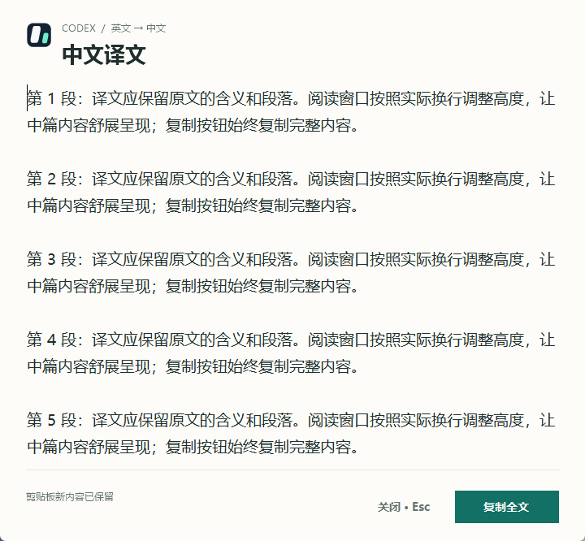

# Codex Companion Translate

[English](README.md) · [简体中文](README.zh-CN.md)

**A small Windows tray companion for Codex:** press **Ctrl+Q** to translate copied Chinese into English, or **Ctrl+E** to translate copied English into Simplified Chinese. Translation rules, model, and reasoning are separate from your main conversation.

## Workflow

**Chinese → English:** Copy Chinese → press **Ctrl+Q** → wait for the completion notice → paste English. A separate CLI request uses app-specific settings and selected recent examples. The compact 264 × 64 popup shows status, not the translation, and closes after five seconds.

**English → Simplified Chinese:** Copy English → press **Ctrl+E**. A centered native reader shows the full translation in 14 pt text, wraps it to fit, and adjusts its height to the content. Long translations can be scrolled and are not truncated. The reader stays open until you press **Esc** or **X**; it does not auto-hide. The full translation is copied automatically.

If you copy something else while a translation is running, that newer clipboard content is preserved. You can manually copy the complete translation from the reader, popup, or tray menu.

## Screenshot




## Download or build

- **Portable release:** [Get the latest ZIP](https://github.com/LiX-Works/codex-companion-translate/releases/latest), extract it, and run `CodexClipboardTranslator.exe`.
- **Source:** clone the [repository](https://github.com/LiX-Works/codex-companion-translate), sign in to Codex CLI with your ChatGPT account (`codex login` if needed), then run at the repository root:

  ```powershell
  ./build.ps1 -Start
  ```

The source build creates a desktop shortcut named **Codex 伴随翻译** and starts the app. The app uses Windows .NET Framework 4 and WinForms.

When updating an older portable ZIP, keep your customized `settings.json`, translation rules and history, and add the new `translation-instructions.zh-CN.txt` file. Source-build updates default a missing `ChineseHotkey` to `Ctrl+E` and copy rule files only when missing.

## How to use and customize

An existing [Codex CLI](https://learn.chatgpt.com/docs/non-interactive-mode) must be installed and signed in before translating. Launch the portable EXE or the source-build desktop shortcut, copy your text, and use **Ctrl+Q** or **Ctrl+E**. Both hotkeys are configurable; Windows may refuse to register one if another app has registered it system-wide. Edit `translation-instructions.txt` for Chinese-to-English rules and `translation-instructions.zh-CN.txt` for English-to-Chinese rules. Recent examples are filtered by translation direction; legacy entries default to Chinese-to-English. Adjust other settings in `settings.json` or the tray menu.

| Setting | Default |
|---|---|
| Chinese-to-English hotkey | `Ctrl+Q` |
| English-to-Chinese hotkey (`ChineseHotkey`) | `Ctrl+E` |
| Model / reasoning | `gpt-6-luna` / `low` |
| Fast mode | Requested; availability and speed depend on account and service |
| Context window | 100,000 tokens |
| Status popup / Chinese reader | 5 seconds / closes with `Esc` or `X` |
| Recent examples | Up to 8, totaling 12,000 characters |
| Proxy | Empty; optional app-specific URL |

The optional proxy is app-specific and leaves Windows settings alone. There is no fixed response-time guarantee.

While the tool is running, its global hotkeys take precedence over in-app actions using the same combination, including common Ctrl+E search actions.

## Account, data, and limits

This is an independent project, not an official OpenAI product. It uses the ChatGPT sign-in already configured in Codex CLI, requires no separate developer API key, and does not fall back to one. Service access, model availability, and account limits follow the CLI client, account, and service.

Translation rules and limited translation history stay local; examples are selected for the current direction. The current text and selected recent examples are sent through Codex CLI for translation. The app does not process images or rich clipboard content, perform speech recognition, or automatically submit translations to Claude or another assistant.

## License

MIT. Keep the `Copyright (c) 2026 LiX-Works` notice and license text with redistributed copies.


